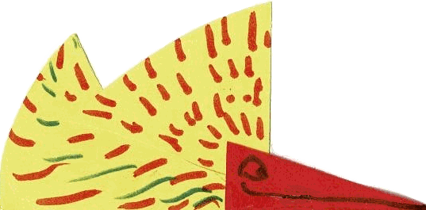

Yet Another Esoteric Programming Language (YEAPL !-)
====================================================

<p align="center"></p>

Rational
--------

LOL ! Almost as much as in Brainfuck, possibly less :)  
Just prove to myself that I can implement a programming language from scratch !

Source of inspirations
----------------------

- In french : Le cerveau Shadok a quatre cases !
https://www.youtube.com/watch?v=DuJDPqb0nvE

- In french : en homage a Jacques Rouxel
https://fr.wikipedia.org/wiki/Les_Shadoks

- Litteral number converter :)
https://www.dcode.fr/shadoks-numeral-system

- The Turing machine implemenation
https://rosettacode.org/wiki/Universal_Turing_machine

- Esolang
https://esolangs.org/wiki/Main_Page

- The Pascal programming language (for the '\#' in string usage)

- Brainfuck (a real gem :)

- x86 assembly language (for the capital letter habit)

- Dos batch (for the label usage)

- ...

Solution folders
----------------

Developed in C++ using VS 2019, still need to be ported under Linux !

- Material : see below
- Common : libraries (headers only !)
- *Generators : littles helpers for Quine & 99 Bottles of beers
- gabuzomeu : the interpreter
- Few files are located outside this solution folder (a top level Common shared by my projects) https://github.com/mderie/Common

Quick start / The material folder
---------------------------------

The interpreter itself (gabuzomeu.exe stand alone executable)

Sample Gabuzomeu source codes

- 99BottlesOfBeer.gbzm (soon available) : see http://www.99-bottles-of-beer.net/
- HelloWorld*.gbzm : see http://helloworldcollection.de/ (multiple implementations)
- Quine*.gbzm (soon available) : Crazy ! See among others https://www.nyx.net/~gthompso/quine.htm
- Factorial*.gbzm : (multiple implementations)
- Reverse*.gbzm : (multiple implementations)
- Rule110 : Bitch ! see https://en.wikipedia.org/wiki/Rule_110
- BNC.gbzm : Demo of the BASE instruction
- IveGotThePower : Demo of the CALC instruction, it supports the pow operator
- parsingTest.gbzm : Limition found for the labels parsing

Miscellaneous text files

- Some *pattern.gbzm : could be used to play with the rule 110 (not as is :(
- Gabuzomeu grammars (ie: in Gold Parser format)
- Futures / Ideas / Extentions / ...

4 unsigned 8 bit "registers" & Constants
----------------------------------------

````
Finally not a good idea to have 4 numerical constants, so no need for brackets, ie [GA]

GA = 0
BU = 1
ZO = 2
MEU = 3
Idea : introduce NEXT as the next target cell ?

Flags

Zero ?
Carry ?
...
````

12+2 keywords (final ?-)
------------------------

````
SCAN (or PEAK) ==> SCAN appartment // Like READ but without moving the input pointer (may set ZF if any) [Optional]
SEEK ==> SEEK expression or maybe SEEK appartment ? Or finally SEEK literal // Move the read pointer (unsigned value, 0 = #GA is the beginning) [Optional]

1) JUMP (or GOTO) ==> JUMP label // Unconditional JUMP to the label, based on the ZF if set or not set ?

DICE (or RAND) ==> DICE appartment // Put a random value from 0 to 255 into the MEU register [Optional]
2) CALC (or EVAL) ==> appartment, expression // The only instruction that takes an math runtime expression !!! (classical operator & appartment combinations)

3) BIRD ==> BIRD appartment // Create a new bird and link the current one from MEU to MEU (may raise exception)... Or from GA to GA ??? Save one operand :) We could also copy the cell contents
4) FREE (or KILL) ==> FREE appartment // Destroy recursively the bird up or down linked to the given appartment

5) PUMP ==> PUMP appartment // Replace peak ? or read ?-)
6) DUMP (or BUMP) ==> DUMP appartment (add support for DUMP constant ?) // Replace write !-)

7) To be combined into one LIFT keyword since two arrow parts can't share the same apparment !!!
MORE ==> MORE appartment // Travel from the current bird to the next one using MEU as source (may raise exception)
LESS ==> LESS appartment // Travel from the current bird to the previous one using GA as target (may raise exception)

8) HEAD ==> HEAD appartment, label // Test if the BU appartement holds an arrow head (followed by ZERO or ELSE) and JUMP to label if true else continue the flow
9) TAIL ==> TAIL appartment, label // Test if the ZO appartement holds an arrow tail
BODY ==> BODY appartment, label // Test if the GA appartment holds neither an arrow head nor an arrow tail [Optional] Not mandatory for v1 since it can be replaced by HEAD & TAIL

10) ZERO ==> ZERO appartment, label // Test if MEU content is equal to zero and JUMP to label if true else continue the flow
11) ELSE ==> ELSE appartment, label // Test if GA content is different from zero and JUMP to label if true else continue the flow

12) LAST ==> LAST label // True/Set Zero Flag if input pointer is beyond the last character (TEST), JUMP to label if true else continue the flow
Idea : introduce another keyword that return the character count not yet processed ?

New !

13) GBZM ==> Start a new instance
14) BASE ==> Change the current number base
````

Very first ideas
----------------

````
CALL label? ==> Unconditional JUMP to label and return ???
READ ==> READ(GA) or GA READ or READ [GA] (may set ZF)
REPL ? // Replace in place for input / output changing ?
COMP ? ==> COMP [BU], "A" or COMP [BU], 65 ? Or both ?
MOVE ==> MOVE [GA], GA
POKE ==> // Like WRIT? but without moving the output pointer, needed ?
WRITE (Find a four letter word here ? https://wordfinder.yourdictionary.com/letter-words/4/)
TURN (aka rotate) ==> TURN GA ? // Needed ?
UP (Find a four letter word here ? https://wordfinder.yourdictionary.com/letter-words/4/)
COUNT ? // Returns the total number of brains/birds
PUSH ==> PUSH MEU // Create a new brain/bird from current MEU (and jump to it ?)
PLOP (FLOP ?) ==> PLOP MEU // Destroy the brain/bird link associated to the MEU register (recursively)
INCR ==> INCR [GA] // Set the Zero flag if overflow ;)
DECR ==> DECR [MEU] // Set the Zero flag
TEST ==> TEST [BU] ? // Is the BU register holding a brain/bird
````

Futures
-------

REPEAT !  
PEEK  
FEEL  
COOL  
LEAF  
DUMB  
BUMP  
NEXT  
PREV  
FALL  
BALL  
MALL  
NULL  
BOIL  
CELL (care largely used in source code)  
LIST  
FEED  
FOOD  
FREE  
FULL  
UNIQ  
IFEQ  
EQUAL Hum !  
IFTH  
TIME  
DATE  
DOWN  
LINK  
SPOT  
BACK  
FORE  
EVAL  
BUMP  
LOAD  
SAVE  
BLOB  
ZERO  
POP   
SCAN  
PULL  
LEFT  
GOTO  
LOOP  
FLAG  
DIFF  
GRAB  
STOP  
CONT  
FIST  
COPY  
CALL ==> CALL label  
RETR // No param :(  
COND  
BIND  
FIND  
KIND  
MIND  
WIND  
DROP  
MESG  
TALK  
PORT  
DUPL  
ROLL  
DICE  
FACE  
MAZE  
BILL  
PILL  
FILL  
BULL  
FUNC  
BUZZ  
EXIT  
FOOL :)  
RULE  
MULE  
FROM  
POOR  
LOVE  
PAIN  
BUFF Idea bidi tmp storage ?  
SKIP  
CIAO (it means both hello & goodbye)  
FILE  
CODE  
TEXT  
DONE  
TONE  
BYTE Idea : Flip io to byte mode  
CHAR Idea : Reverse of above  
STAR  
TEAR  
GRUB  
GRAB  
GREP  
GRIP  
HERE  
FISH  
XCHG  
SIZE  
UNDO  
REDO  
GLOB  
BLOB  
CLOB  
BEAT  
MEAT  
NEAT  
FEET  
FOOT  

Gross (the infamous four lette words !-)
----------------------------------------

POOP  
SHIT  
FUCK  
CUNT  
DICK  
CRAP  
BUTT  
PISS  
TITS  
COCK  
DAMN  
SLUT  
....  

Comments
--------

C/C++ like : // at the end of line or /* & */ for line block. Or just ';' ? ==> Yes !

Future / Extentions
-------------------

TODO: See file ? in material folder ?

Charset (finally it is a platform concern)
------------------------------------------

ISO-8859-1 (https://en.wikipedia.org/wiki/ISO/IEC_8859-1)

labels (used for JUMP)
---------------------

- Preceeded by a colon ==> ":loop" for the declaration and without colon for the definition (usage)  
- Definition and usage must be followed by at least one "space" character (CR, LF, TAB, or SPC)  

Exceptions (runtime)
--------------------

- Illegal "stack" operations (not implemented)
- Illegal literal
- Missing label
- Seek out of bound while reading
- Base not supported
- ...

Exceptions (interpreter)
------------------------

- File not found
- Alien
- ...

Termination
-----------

- When there is no more instruction !-) No need for exit 0 or stop for now...  
- A valid program may (begin and) end with a ":end" label for example.  

I/O
----

Virtual unlimited input and output characters (remember that the command line capacity is OS dependant)

Nibbles
-------

When performing IO, the numbers are processed either as being in the default base (so it is 256 a plain old byte :)
either as being in another known bases. But in thoses cases, the number representation must be surrounded by '\#'.
Some sample nibbles below in each base : 

````
#01110# in base #ZO (aka 2)
#GABU# in base #BUGA (aka 4)
#31# in base #ZOZO (aka 10)
#C0FFEEBABE# in base #BUGAGA (aka 16)
#ABba# in base #BUGAGAGA (aka 64)
````

The BASE instruction takes either a cell either a litteral (so in base \#BUGA) and allows to change the current base
for the next I/O. It affects the DUMP & PUMP instructions whatever the data comes from / ends up in a file or 
taken / shown at the console.

Interpreter
-----------

Who needs a compiler ?-)
Portable command line based program that takes two arguments : a text file (ideally *.gbzm) and an input string
between double quotes. The runtime loads the text file and provides the input string to the running gabuzomeu program.
Finally the interpreter "collected" string output is shown at the program end's.

Command line parameters of the interpreter
------------------------------------------

````
gabuzomeu (--file="file_name.gbzm" | --program="text") (--source="file_name" | --data="value") [--target="file_name"]
          [--limit=\"number\"] [(-i | --interpret)] [(-a | --analysis)] [(-b | --big)] [(-Q | --Quine)] [(-w | --write)]

[] optional
() grouping
| choosing
- one letter
-- full name

Where the file or the program must be provided, the same goes for the source or the data
Strings can't contain double quote, screen data in input or output may hold
#numeric_nibbles# in gabuzomeu base four in order to replace the non printable characters
On the other hand, file data are treated as stream of bytes
The optional target is to redirect the output toward a file instead of the screen as default
The two optional interpret and analysis flags are there for tracing purpose
Finally the optional big flag allows the support of number bigger than a byte
New flags ! Quine parameter allows nibble output without trailing #
write force the character printing on the console for the ASCII code below 32
limit can be used in order to break infinite loop after a given number of instruction
````

literals (numbers only in the language)
---------------------------------------

Characters : Enclosed in single quote ==> Finally not supported (voluntary obfuscation :)
Numbers : Using the base four notation (GA BU ZO MEU related), preceded with ² or surrounded by """ but then the command line failed :(
==> for gabuzomeu experts only ;-)

````
0 = "GA"
1 = "BU"
2 = "ZO"
3 = "MEU"
4 = "BUGA"
5 = "BUBU"
27 = "GABUZOMEU" !-)
100 = "BUZOBUGA"
104 = "BUZOZOGA" = 'h'
````

Or with one (maybe two \#)

````
0 = #GA
1 = #BU
2 = #ZO
3 = #MEU
4 = #BUGA
5 = #BUBU
10 = #ZOZO = LF
13 = #MEUBU = CR
27 = #GABUZOMEU
31 = #BUMEUMEU = Bing !
100 = #BUZOBUGA = 'd'
104 = #BUZOZOGA = 'h'
````

Or only gabuzomeu litteral between single quotes (to ease the command line ?)

Numbers from / to the outside
-----------------------------

The supported bases are 2, 4, 10, 16, 64 & 256 Where the later actually means make use of the ascii code for representing them.
Obviously numbers below ascii code 32 are not printable. They are shown as using gabuzomeu base 4 notation between \#
For the others bases, since we don't know in advance their length, they must be enclosed as well by \#
In order to please the padawan programmers, the default base is the fourth one for the code and 256 for the I/O
The BASE keyword allow a base change for further I/O operations. Big numbers (arbitray long positive integers)
support can be set by using the -b or --big parameter else the default number size is the byte.

What's look like a bird brain... In Gabuzomeu
---------------------------------------------

One cell contains a positive or null number that fits on one byte.
Or more bytes if the -b | --big number parameter is specified

````
          _.--.---.          
      ,-''    |    `--.      
    ,'        |        `.    
   /          |          \   
  /    GA     |    BU     \  
 /            |            \ 
;             |             :
+-------------+-------------+
:             |             ;
 \            |            / 
  \    ZO     |    MEU    /  
   \          |          /   
    `.        |        ,'    
      '--.    |    _.-'      
          `---+--''
````

From one bird to another one
----------------------------

It should be seen as taking a lift : here we have both "GA" cells linked
The LIFT instruction is able to travel both ways, although the HEAD keyword
test the presence of the arrow... Head ! The same goes for the TAIL one !

````
                 Bird 1

               _.--.---.
           ,-''    |    `--.
         ,'        |        `.
        /    ^     |          \
       /    /|\    |           \
      /    / | \   |            \
     ;       |     |             :
     +-------+-----+-------------+
     :       |     |             ;
      \      |     |            /
       \     |     |           /
        \    |     |          /
         `.  |     |        ,'
           '-+.    |    _.-'
             | `---+--''
             |
             |
             | _.--.---.
           ,-+'    |    `--.
         ,'  |     |        `.
        /    |     |          \
       /     ^     |           \
      /     / \    |            \
     ;     /   \   |             :
     +-------------+-------------+
     :             |             ;
      \            |            /
       \           |           /
        \          |          /
         `.        |        ,'
           '--.    |    _.-'
               `---+--''

                 Bird 2
````

Allowed bird links (start & end of arrows share the same cell names)
--------------------------------------------------------------------

- Bird 1 have a tail in ZO
- Bird 2 have a head in ZO and a tail in MEU
- Bird 3 have a head in MEU

````
            Bird 1                                    Bird 2

          _.--.---.                                 _.--.---.
      ,-''    |    `--.                         ,-''    |    `--.
    ,'        |        `.                     ,'        |        `.
   /          |          \                   /          |          \
  /           |           \                 /           |           \
 /            |            \               /            |            \
;             |             :             ;             |             :
+-------------+-------------+             +-------------+-------------+
:     \       |             ;             :       \     |    |        ;
 \     \      |            /               \       \    |    |       /
  \     >-----+-----------+-----------------+------->   |    |_____ /
   \   /      |          /                   \     /    |   ,'     /
    `./       |        ,'                     `.  /     |  /     ,'
      '--.    |    _.-'                         '--.    |,'  _.-'
          `---+--''                                 `---/--''
                               _.--.---.              ,'
                           ,-''    |    `--.         /
                         ,'        |        `.     ,'
                        /          |          \   /
                       /           |           \,'
                      /            |          ,'\
                     ;             |         /   :
                     +-------------+-------,'----+
                     :             |  |   /      ;
                      \            |  | ,'      /
                       \           |  +____    /
                        \          |          /
                         `.        |        ,'
                           '--.    |    _.-'
                               `---+--''
							   
    						     Bird 3
````

Disallowed bird links
---------------------

Multiple arrow head's or tail's within the same cell is forbidden !

````
          _.--.---.                                 _.--.---.
      ,-''    |    `--.                         ,-''    |    `--.
    ,'        |        `.                     ,'        |        `.
   /          |          \                   /          |          \
  /           |           \                 /           |           \
 /            |            \               /            |            \
;             |             :             ;             |             :
+-------------+-------------+             +-------------+-------------+
:             |             ;             :             |             ;
 \            |            /               \            |            /
  \           |    +----  /                 \ ----+     |           /
   \          |    | \   /                   \ ,' |     |          /
    `.        |    |  \,'                    ,'.  |     |        ,'
      '--.    |    _.-'\                   ,'   '--.    |    _.-'
          `---+--''     \                ,'         `---+--''
                         \     _.--.---,'
                          \,-''    | ,' `--.
                         ,'\       ,'       `.
                        /   \    ,'|          \
                       /     \ ,'  |           \
                      /     __'__  |            \
                     ;        |    |             :
                     +-------------+-------------+
                     :             |             ;
                      \            |            /
                       \           |           /
                        \          |          /
                         `.        |        ,'
                           '--.    |    _.-'
                               `---+--''
````

So two arrows can't share the same tail.

````
          _.--.---.                                 _.--.---.
      ,-''    |    `--.                         ,-''    |    `--.
    ,'        |        `.                     ,'        |        `.
   /          |          \                   /          |          \
  /           |           \                 /           |           \
 /            |            \               /            |            \
;             |             :             ;             |             :
+-------------+-------------+             +-------------+-------------+
:             |      |      ;             :        |    |             ;
 \            |   ___|     /               \       |___ |            /
  \           |       \   /                 \    ,'     |           /
   \          |       `. /                   \ ,'       |          /
    `.        |        |'                    ,'.        |        ,'
      '--.    |    _.-' \                  ,'   '--.    |    _.-'
          `---+--''      \               ,'         `---+--''
                          \    _.--.---./
                           \-''    |  ,'`--.
                         ,'`.      |,'      `.
                        /   | |   ,'          \
                       /     \| ,' |           \
                      /    ---+--- |            \
                     ;             |             :
                     +-------------+-------------+
                     :             |             ;
                      \            |            /
                       \           |           /
                        \          |          /
                         `.        |        ,'
                           '--.    |    _.-'
                               `---+--''
````

Nor can they share the same head.

````
          _.--.---.                                 _.--.---.
      ,-''    |    `--.                         ,-''    |    `--.
    ,'        |        `.                     ,'        |        `.
   /          |          \                   /          |          \
  /           |           \                 /           |           \
 /            |            \               /            |            \
;             |             :             ;             |             :
+-------------+-------------+             +-------------+-------------+
:             |      |      ;             :    -----+   |             ;
 \            |   ___|     /               \       ,|   |            /
  \           |       \   /                 \    ,' |   |           /
   \          |       `. /                   \ ,'   |   |          /
    `.        |        |'                    ,'.        |        ,'
      '--.    |    _.-' \                  ,'   '--.    |    _.-'
          `---+--''      \               ,'         `---+--''
                          \    _.--.---./
                           \-''    |  ,'`--.
                         ,' |      |,'      `.
                        /   | |   ,'          \
                       /     \| ,' |           \
                      /    ---+    |            \
                     ;        |    |             :
                     +-------------+-------------+
                     :             |             ;
                      \            |            /
                       \           |           /
                        \          |          /
                         `.        |        ,'
                           '--.    |    _.-'
                               `---+--''
````

Finally they can't follow each other neither...

Miscelleanous
-------------

- One brain/bird at time, four appartements or braincells or simply cells (numbered from 0 to 3 ?) or just named ?-)
- Character collection processor ? Well do the word processor for the V2
- Each appartement could be either a single character storage or an appartment arrow
- Input pointer / output pointer (both with or without overwritting ?)
- After a TEST or COMP the JUMP instruction is a conditional one (same for LOOP ?)
- One instruction per line in a file ==> No ! The grammar is strong :)
- Or take the first input string as program with ';' as separator and the second command line parameter is the data ==> Do we really need instruction separator ?
==> byte stream in gabuzomeu notation (nibble based) ? \#MEUBU\#ZOZO ==> This allows to pass non printable characters :)
Again Pascal syntax is as follow 'Hello,'\#13\#10'world!' So we can mix double quotes and \#values if they are in one block :)
- Case insensitive
- Accept ';' as instruction separator. Allow single line program !-)
- byte and char are exchangeable (but char is for the ouside world and (big) number is the only rule)
- When the progam starts there is only one bird and all of its appartments hold zero (as any new bird)
- input string can be empty !-)

Language evolution
------------------

- Introduce a counter register ?
- Introduce the LOOP keyword ?

See also in the material folder four raw ideas

Care : command line limitation (OS related topic)
-------------------------------------------------

https://www.cyberciti.biz/faq/linux-unix-arg_max-maximum-length-of-arguments/
Try the following command  
getconf ARG_MAX

Under all the Windows...
https://stackoverflow.com/questions/3205027/maximum-length-of-command-line-string

In C/C++ the program entry point is as follow :  
int main(int argc; char *argv[])

A Gabuzomeu program does not have input parameters nor return values
but it can read input value(s) and write output value(s). Those values
may be provided from / to file or from / to the console. See the GBZM "special" instruction [02/06/2020]

Roadmap
-------

- 99 Bottles of beer (ongoing)
- Quine (ongoing, the POC is done :)
- Enhance the parsing error messages
- Still a lot of debug prints... (See the numerous //TODO: "tags")
- Code could / should be cleaned a little bit :)
- Linux porting
- Versionning on the language itself ? On the interpreter ?
- Building a true IDE (with birds visualisations, line by line debugging and so on !)
- Implement unit tests
- Implement a BF cross stuff
- Implement a compiler !
- Review this document title order and start by the TOC (missing feature in Markdown :(
- ...

License
-------

- Well... Smileware ? I really doubt that any of the stuff shared here is valuable in anyway !
- But it is free (see https://en.wikipedia.org/wiki/Gratis_versus_libre)
- Found no information about "Shadocks" copyright, even less about ga bu zo meu (& ni ! Nor about the gibis...)

Greetings
---------

- My wife (who had to support my "divagations"... But she once played with the universal Turing Machine !-)
- My daugther for the bird logo :)
- Jarro2783 for the cxxopts library (https://github.com/jarro2783/cxxopts)
- R35382 for the bnflite library (https://github.com/r35382/bnflite)
- Sercantutar for the infint library (https://github.com/sercantutar/infint)
- Stephen Wolfram & Matthew Cook (Seems to be controversial ! Rule 110 proof)
- Bjarne Stroustrup (C++ obviously :)
- Douglas Hofstadter (GEB)
- Urban Müller (BrainFuck)
- Richard Stallman (GPL, FSF, ...)
- Linus Torvalds (Linux, GIT, ...)
- All demosceners (you rocks !)
- All esoteric language creators so far
- Markus Gebhard (I've used Jave for the ASCII "art" :) http://www.jave.de/
- ...

May they RIP
------------

- Jacques Rouxel (Shadoks)
- Alan Turing (Universal Turing Machine among other discoveries / inventions)
- Niklaus Wirth (Pascal)
- Willard Van Orman Quine (Quine :)
- ...

````
That's all folks ! (this project has started the ten of May 2020 / mderie@gmail.com / Coded by Sam Le Pirate [TFL-TDV])
````
